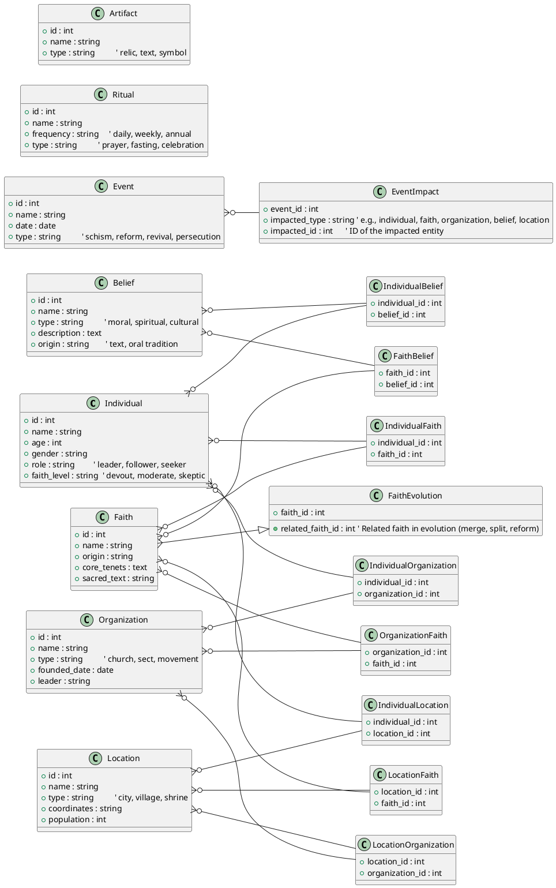

Here's the current data model:

---

class Sentiment(IntEnum):
    STRONGLY_DISAGREE = -2
    DISAGREE = -1
    NEUTRAL = 0
    AGREE = 1
    STRONGLY_AGREE = 2

---

Here’s a summary of the conversation so far:

	1.	Initial Modeling:
	•	We started by exploring how to model relationships between Individuals and Beliefs/Faiths, discussing whether faith should be a cross-section of beliefs, a specific type of belief, or a distinct concept. The recommendation was to treat Faith as a distinct concept for realism and flexibility.
	2.	Modeling Beliefs:
	•	We discussed whether beliefs should be atomic (single entities) or split into Concept and Sentiment to model varying perspectives on a single idea (e.g., “Charity is good” vs. “Charity is bad”).
	•	Ultimately, we leaned toward simplifying the model by linking Individuals directly to Concepts, with a relationship capturing Sentiment (e.g., strongly agree, disagree).
	3.	Naming Relationships:
	•	Suggested terms for naming the relationship between Individual and Concept, such as Perspective, Alignment, Conviction, Opinion, Disposition, and Stance.
	•	The user preferred simplicity by naming join tables as IndividualConcept and other combinations, avoiding a third term unless necessary.
	4.	Alternatives to “Concept”:
	•	Explored potential replacements for Concept (e.g., Idea, Principle, Value, Doctrine, Tenet, Ethos, Philosophy, Perspective, etc.).
	•	The user selected Doctrine for its clarity and purpose, even though it might be slightly specific.

Final Direction:
	•	The user has decided to use Doctrine as the central term representing abstract ideas or principles.
	•	The relationship between entities (e.g., IndividualDoctrine, OrganizationDoctrine) will be represented simply and clearly, with "sentiment" field capturing the individual’s or entity’s stance.

---

Update the data model to reflect the decisions made in the conversation.

---
Here’s the updated UML data model reflecting the decisions made in the conversation:

Updated UML Diagram

@startuml updated-religion-simulation

' Set direction for easier readability
left to right direction

' Core Classes with Attributes and Properties
' An Individual represents a person with specific attributes.
class Individual {
  + id : int
  + name : string
  + age : int
  + gender : string
  + role : string         ' leader, follower, seeker
}

' A Doctrine represents an abstract idea or principle.
class Doctrine {
  + id : int
  + name : string
  + type : string          ' moral, spiritual, cultural
  + description : text
  + origin : string        ' text, oral tradition
}

' An Organization is a group of individuals united by shared goals or doctrines.
class Organization {
  + id : int
  + name : string
  + type : string          ' church, sect, movement
  + founded_date : date
  + leader : string
}

' A Faith represents a system of doctrines followed by individuals or groups.
class Faith {
  + id : int
  + name : string
  + origin : string
  + core_tenets : text
  + sacred_text : string
}

' A Location is a place where individuals, organizations, and faiths exist.
class Location {
  + id : int
  + name : string
  + type : string          ' city, village, shrine
  + coordinates : string
  + population : int
}

' An Event represents historical occurrences affecting doctrines, faiths, or organizations.
class Event {
  + id : int
  + name : string
  + date : date
  + type : string          ' schism, reform, revival, persecution
}

' Join Table for Individual's stance on a Doctrine
class IndividualDoctrine {
  + individual_id : int
  + doctrine_id : int
  + sentiment : int         ' STRONGLY_DISAGREE to STRONGLY_AGREE
  + notes : text            ' Optional field for additional context
}

' Join Table for Organization's stance on a Doctrine
class OrganizationDoctrine {
  + organization_id : int
  + doctrine_id : int
  + sentiment : int         ' STRONGLY_DISAGREE to STRONGLY_AGREE
}

' Faiths are composed of multiple doctrines.
class FaithDoctrine {
  + faith_id : int
  + doctrine_id : int
  + importance : float      ' Weight of the doctrine within the faith
}

' Locations can host organizations and faiths.
class LocationFaith {
  + location_id : int
  + faith_id : int
}

class LocationOrganization {
  + location_id : int
  + organization_id : int
}

' Events can influence individuals, organizations, faiths, doctrines, and locations.
class EventImpact {
  + event_id : int
  + impacted_type : string ' e.g., individual, doctrine, organization, faith, location
  + impacted_id : int      ' ID of the impacted entity
}

' Relationships
' Use one-to-many and join tables to represent relationships.

Individual }o-- IndividualDoctrine
Doctrine }o-- IndividualDoctrine

Organization }o-- OrganizationDoctrine
Doctrine }o-- OrganizationDoctrine

Faith }o-- FaithDoctrine
Doctrine }o-- FaithDoctrine

Location }o-- LocationFaith
Faith }o-- LocationFaith

Location }o-- LocationOrganization
Organization }o-- LocationOrganization

Event }o-- EventImpact

@enduml

Key Changes
	1.	Doctrine as Central Concept:
	•	Replaced “Belief” and “Concept” with Doctrine to represent abstract ideas or principles clearly.
	2.	Individual and Doctrine Relationship:
	•	Replaced IndividualBelief with IndividualDoctrine, capturing the sentiment (e.g., agree/disagree) and optional notes for context.
	3.	Organization and Doctrine Relationship:
	•	Added OrganizationDoctrine to model how organizations align with doctrines, using a similar sentiment field.
	4.	Faith as a Collection of Doctrines:
	•	Replaced FaithBelief with FaithDoctrine to show that faiths are composed of multiple doctrines, with an optional importance weight.
	5.	Simplified Attributes:
	•	Removed unused attributes like faith_level from Individual, aligning with the focus on doctrine relationships.

Example Scenarios
	1.	An Individual’s Stance on Charity:
	•	Doctrine: “Charity”
	•	IndividualDoctrine: sentiment = 2 (STRONGLY_AGREE)
	2.	A Faith’s Core Tenets:
	•	Faith: “Christianity”
	•	FaithDoctrine: Includes doctrines like “Charity” and “Forgiveness” with specific importance weights.
	3.	An Organization’s Alignment:
	•	Organization: “Red Cross”
	•	OrganizationDoctrine: Aligns strongly with “Charity” (sentiment = 2) and “Neutrality” (sentiment = 1).

This updated model simplifies and clarifies the relationships while retaining flexibility for realistic and complex scenarios.